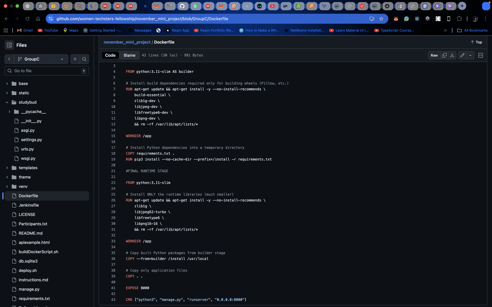
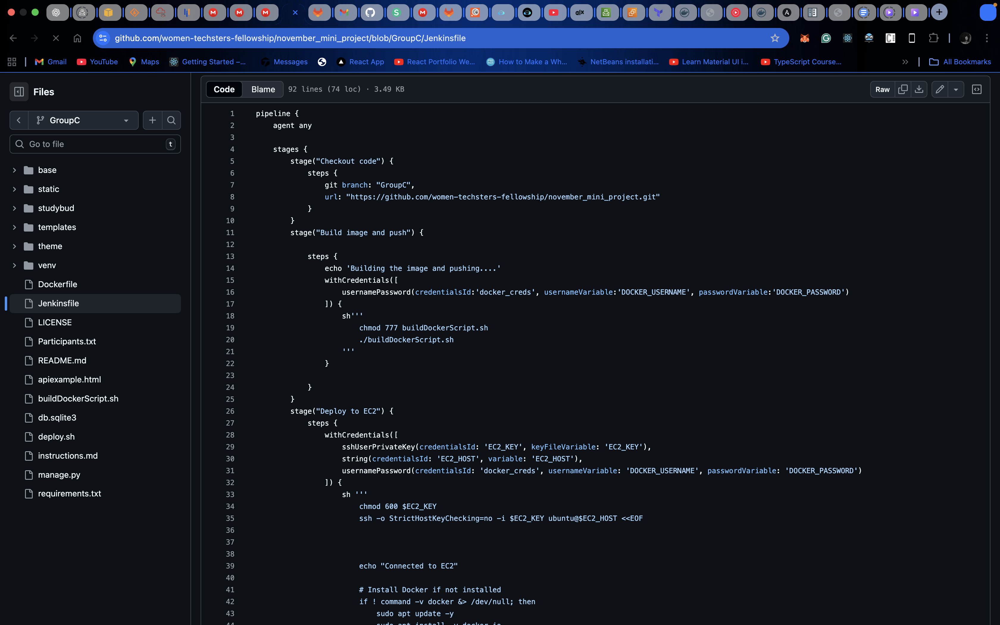
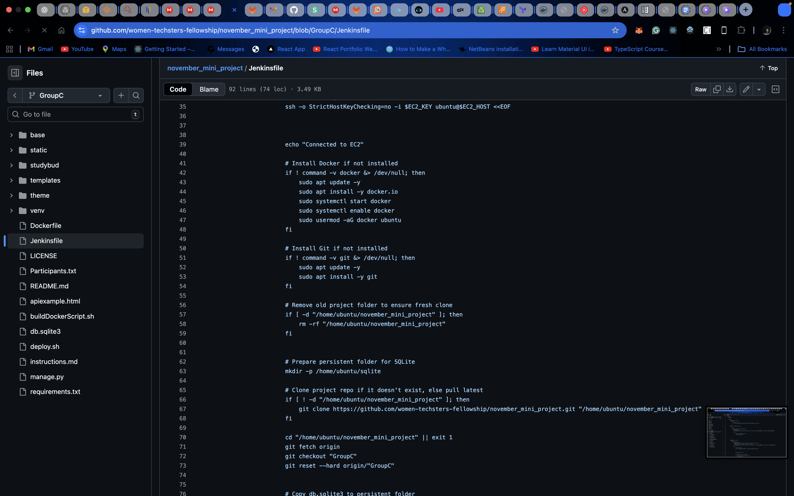
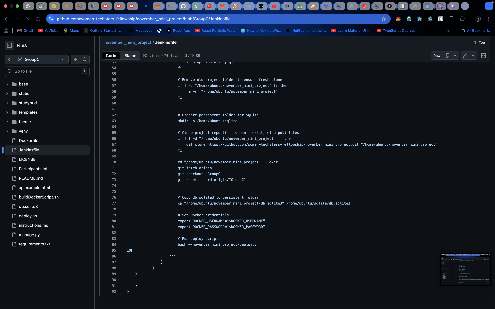
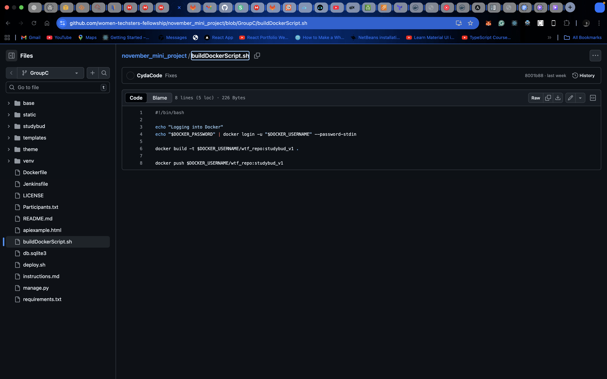
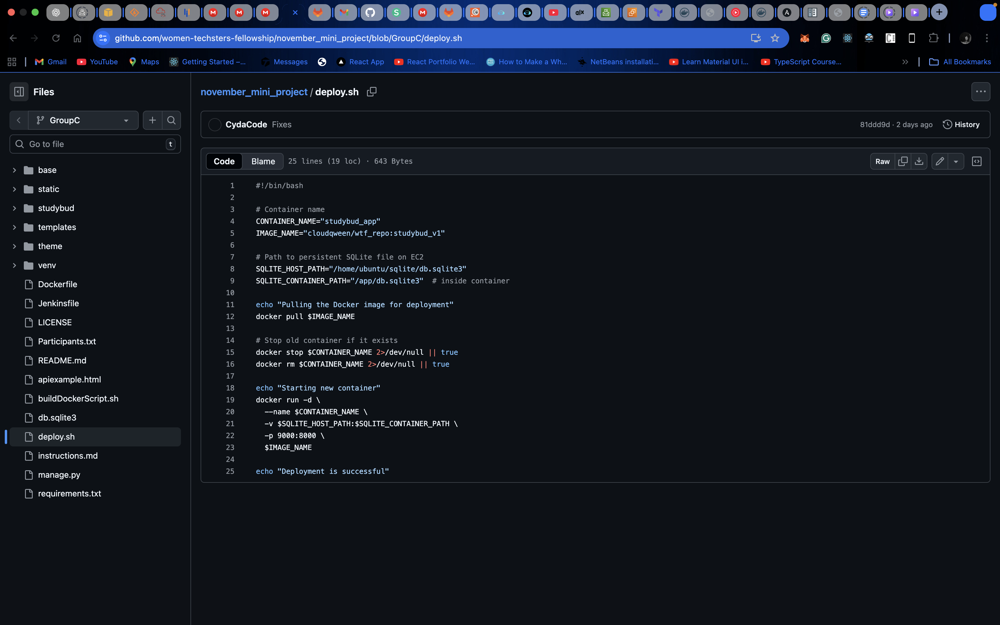
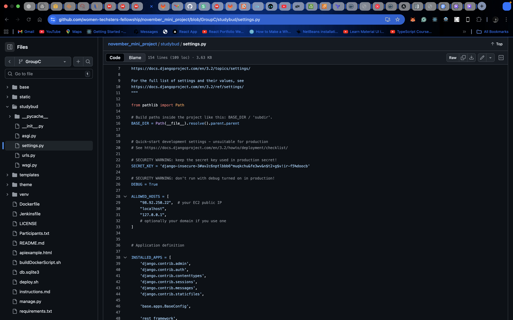
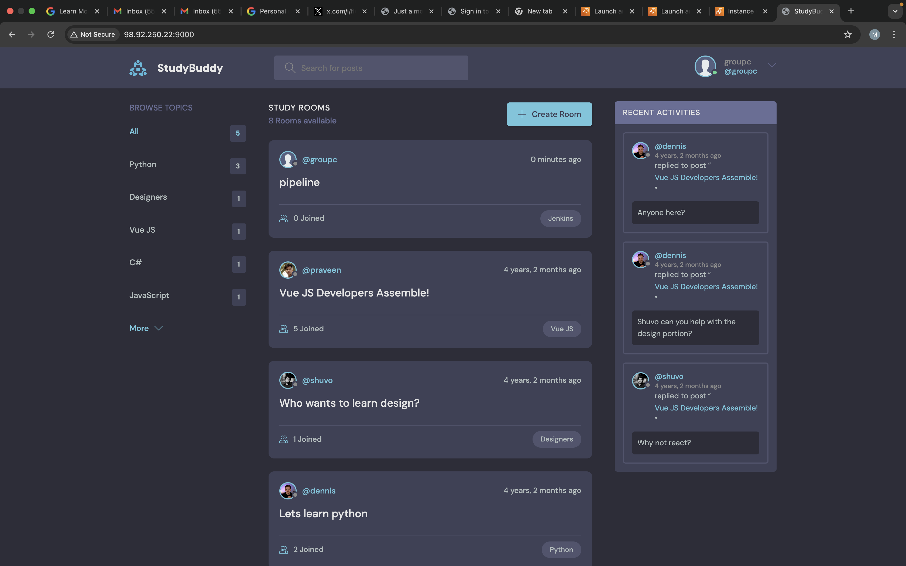

# StudyBud — Deployment Documentation (Group C)

**Project:** StudyBud  
**Group:** Group C  
**Date:** 13 Dec 2025  

**Live Application URL:**  
➡️ [http://98.92.250.22:9000](http://98.92.250.22:9000)

---

## 1. Project Overview

This document describes the complete **CI/CD deployment process** for the StudyBud application.  
The deployment uses **Jenkins, Docker, and AWS EC2** to automate building, packaging, and releasing the application.

The system supports **persistent user data**, allowing users to:
- Sign up  
- Log in after redeployment  
- Create posts and TGroups without losing data

---

## 2. Architecture Summary

- **Source Control:** GitHub  
- **CI/CD Tool:** Jenkins  
- **Containerization:** Docker (multi-stage build)  
- **Server:** AWS EC2 (Ubuntu 24.04 LTS)  
- **Backend Framework:** Django  
- **Database:** SQLite (persistent)  
- **Branch Used:** `GroupC`

---

## 3. Deployment Artifacts (Screenshots)

The following deployment components were implemented and verified:

- Dockerfile  
- Jenkinsfile  
- `buildDockerScript.sh`  
- `deploy.sh`  
- Django `settings.py` (`ALLOWED_HOSTS`)  
- Jenkins successful build UI  
- Live application running on EC2  

---

## 4. Docker Configuration

The Dockerfile defines how the StudyBud application is containerized.  
We implemented a **multi-stage Docker build** to reduce the image size from ~500MB to ~200MB.

 <!-- Replace with your actual image path -->

---

## 5. Jenkins Pipeline Setup

The Jenkinsfile defines the **CI/CD pipeline stages**:
- Source code checkout  
- Docker image build (multi-stage)  
- Docker Hub push  
- EC2 deployment

  
  

---

## 6. Build & Deployment Scripts

Custom scripts were used to automate Docker image building and EC2 deployment:

- **buildDockerScript.sh**  
    

- **deploy.sh**  
    

---

## 7. Django Configuration

To allow external access, the EC2 public IP was added to **ALLOWED_HOSTS** in `settings.py`.

---

## 8. Database Persistence (SQLite)

SQLite was configured with **persistent storage on the EC2 host**, so data is retained across container restarts and redeployments.

**Impact:**
- Users can sign up and log in successfully  
- User accounts persist across deployments  
- Users can create posts and TGroups  
- Created content remains after container restarts

---

## 9. Jenkins Build Verification

The Jenkins pipeline completed successfully with all stages passing.

---

## 10. Live Application Verification & Database Persistence (SQLite)
SQLite was configured with **persistent storage on the EC2 host**, so data is retained across container restarts and redeployments.

**Impact:**
- Users can sign up and log in successfully  
- User accounts persist across deployments  
- Users can create posts and Groups  
- Created content remains after container restarts

- Application running on EC2  
- Signup page  
- Group creation  

  

---

## 11. Errors Encountered & Resolutions

| Issue | Resolution |
|-------|------------|
| Jenkins script parsing errors | Deployment logic moved to scripts |
| Old code running on EC2 | Clean redeployments enforced |
| Port mismatch | Docker ports aligned with Django |
| ALLOWED_HOSTS error | EC2 IP added |
| Data loss on restart | SQLite persistence implemented |

---

## 12. Conclusion

The StudyBud application was successfully deployed using a **multi-stage Docker build** in a **Jenkins CI/CD pipeline**, hosted on **AWS EC2**, and configured with **persistent SQLite storage**.  

Users can interact with the application, create accounts, posts, and Groups, and data persists across redeployments.

---

